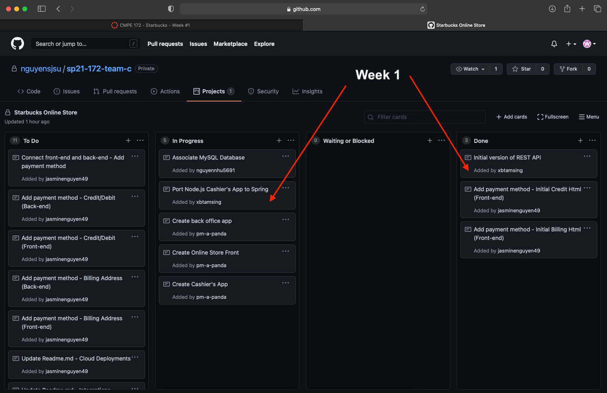

# Week 1 Individual Journal - Brian Tamsing

## Snapshot

## Discussion

- Completed a fully functioning Starbucks REST API, following the assignment specs.
  - Commit: https://github.com/nguyensjsu/sp21-172-team-c/commit/e15d932046916b72f4858ddf1d4e96cb05be57fb
- Began porting the provided Node.js Cashier's App over to SpringMVC. The initial work done is primarily on the front-end.
  - Commit: https://github.com/nguyensjsu/sp21-172-team-c/commit/2f89bd3632c50e49f52366d42b2796fd3c8070c3

## Challenges

- Cashier's App Port
  - It was a bit difficult navigating the Node.js Cashier's App due to limited experience with Node, but so far I have been reading Node documentation wherever I need help understanding parts of the provided code.
  - Planning a design direction for our Cashier's App has also been interesting, as I am trying to balance the implementation of required features while at the same time trying to design an application with great UI/UX.
  - Understanding the overall flow of data for the Cashier's App took a bit of time to think about, but I referenced prior labs and it helped to give me a big picture about how the app will work and interface with our REST API.