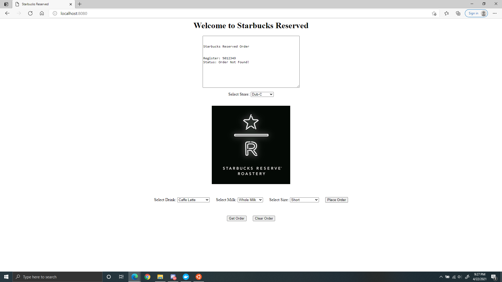
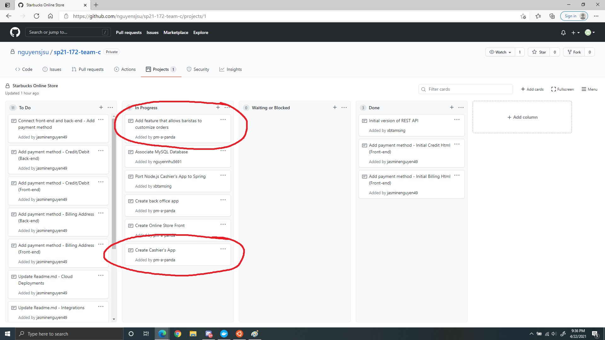

# Week 1 Individual Journal - Jimmy Lee

I ran the following functions to get the cashier's app onto the local host.
* docker network create --driver bridge starbucks
* docker run --network starbucks --name starbucks-api -p 3000:3000 -td paulnguyen/starbucks-api:v1.0
* make docker-launch

I edited the nodejs folder to start implementing the feature that allows our baristas to select and customiza an order for the customer. I also started editing the UI. 

# Card Snapshot

# Challenges

I'm still trying to figure out how to carry variables over from the html file to java file. 
