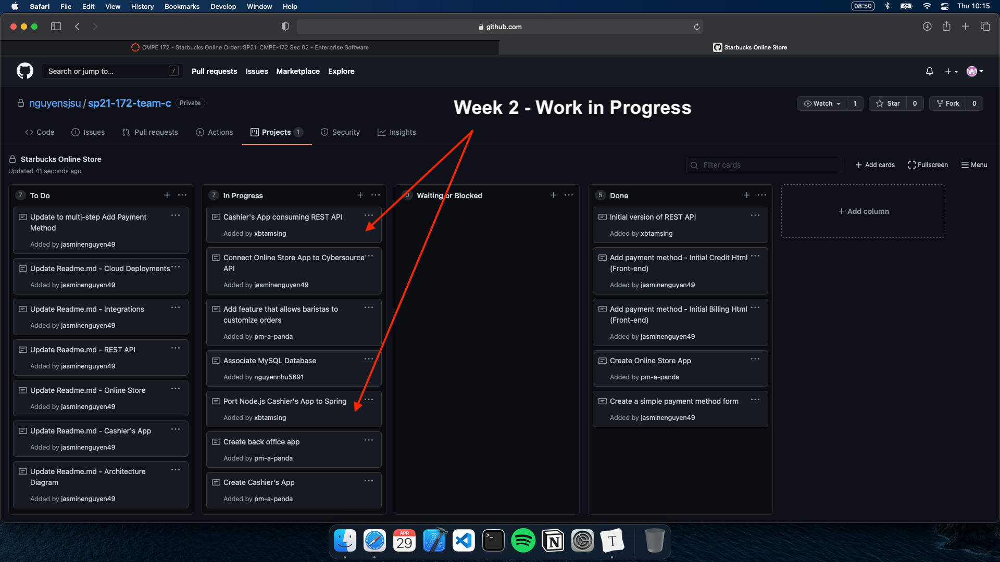

# Week 2 Individual Journal - Brian Tamsing

## Snapshot

## Discussion

- Connected the front and back-ends of the Spring Cashier's App and managed to successfully consume the REST API.
  - Commit: https://github.com/nguyensjsu/sp21-172-team-c/commit/8e8f601997053b72d8fb8bc8a7fee856a39fa1a0

## Challenges

- Front and back-end integration
  - Understanding the flow from initial get request (on page landing) to post request ("get order," for example) and what code to run in the controller took some time, but I was able to get everything working and obtain the information needed in order to consume the REST API.
  - Also, I had to refer to the CyberSource lab as well as the Internet to understand how to properly parse the JSON retrieved from the API and use Jackson's ObjectMapper class to map it to an OrderResponse object.
- Consuming the REST API
  - For this portion, I had to read up on online documentation about how to perform HTTP requests in Java, as it is something I have never done. I was able to consume our API and retrieve order information for rendering back in the view using Thymeleaf.