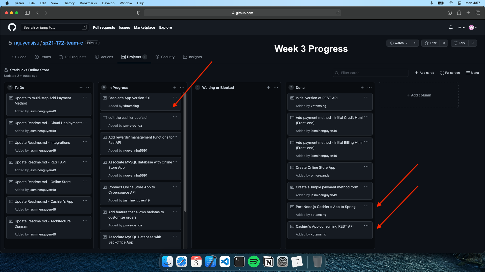

# Week 3 Individual Journal - Brian Tamsing

## Snapshot

## Discussion

- Added a script to the cashiers.html template to keep the selected store after sending a post request.
  - Commit: https://github.com/nguyensjsu/sp21-172-team-c/commit/6af94a4c9b891b23c150d538f3b956920468f6d2
- Completed the Node.js Cashier's App port to Spring, and associated calls to our REST API.
  - Commit: https://github.com/nguyensjsu/sp21-172-team-c/commit/86cd7f4afc3e053a7c1b9e7818a487ad39078627

## Challenges

- No real issues, just some had to do some thymeleaf documentation research regarding how to embed javascript inside of html source files.
- Also not a challenge, but discussed with Jimmy the features remaining for the Cashier's App.