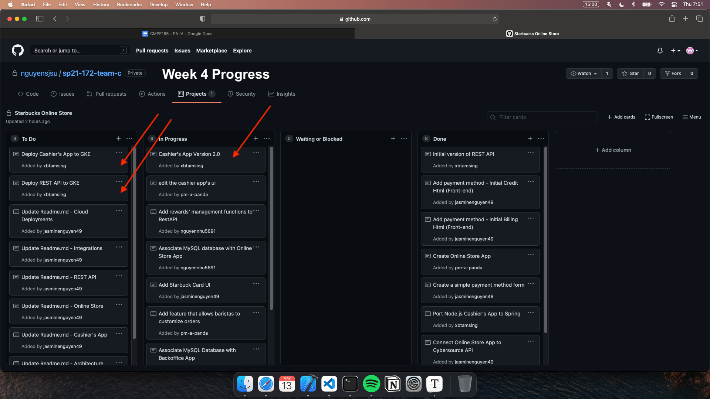

# Week 4 Individual Journal - Brian Tamsing

## Snapshot

## Discussion

- Cashier's App is getting cleaned up currently by Jimmy, as he adds the ability to create a Starbucks order and send it over to our REST API.
- After he completes this, I plan to add the last piece which is to give the barista the ability to input a Starbucks Card number.
- In the meantime, I have been reviewing past labs preparing for our future app deployment to GCP and GKE.

## Challenges

- None on the Cashier's App side of things
- I am currently making sure that any necessary deployment file is ready and understood so that our deployment goes smoothly. So far, no major issues, just simply reviewing.