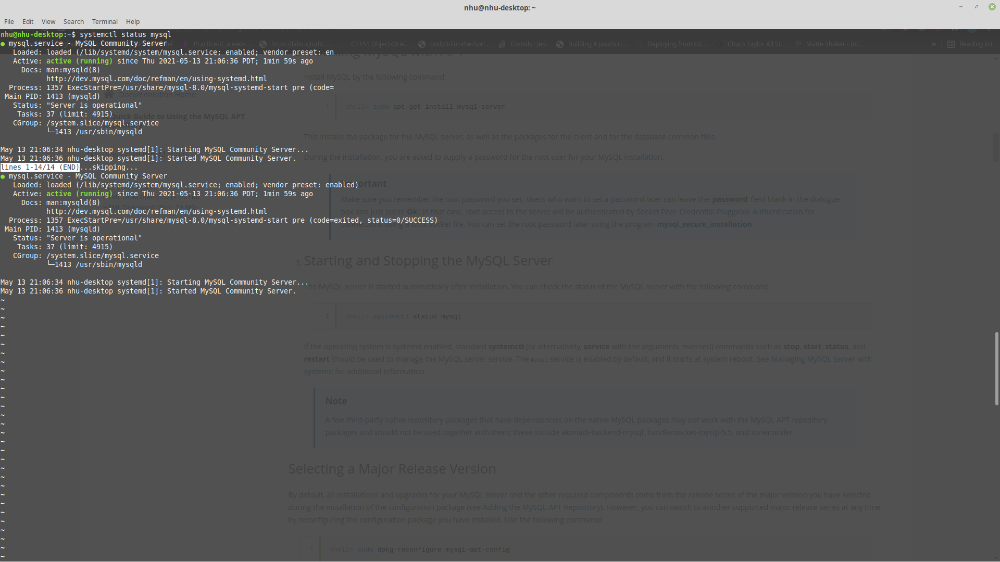
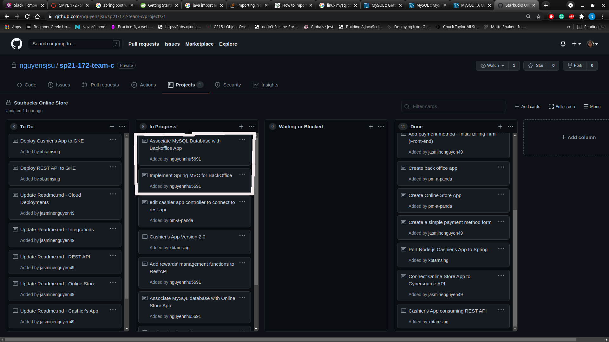

# Week 4 Individual Journal - Nhu Nguyen
## Tasks
* Create MySQL database
* Associate 3 applications so that they share access to a common database
* Associate common utilities such as StarbucksCard
## Accomplishments
* Create and run a MySQL database

## Challenges
* Since we want separate applications, we find a hard time importing and using classes of one project in another. For example, the OnlineStore needs access to manage StarbucksCard but we do not want to have repeated code.  
## Solutions
* Restructuring the architecture so that common classes are accessible by all the apps. 
## Task Board
